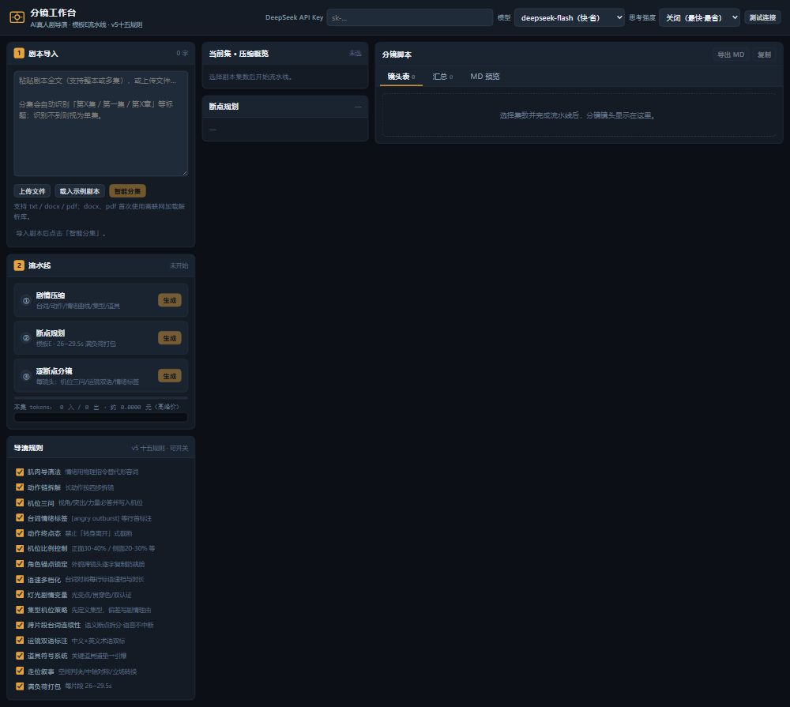
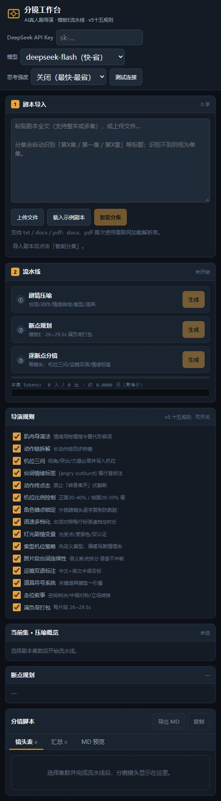

# 分镜工作台 · AI真人剧导演

单文件本地网页应用：上传剧本 → 智能分集 → 三步流水线（剧情压缩 → 断点规划 → 逐断点分镜）→ 导出模板E六段 Markdown 分镜脚本。配套完整「导演十五规则 v5」方法论文档。

## 界面预览

桌面端 | 移动端
--- | ---
 | 

## 目录结构

```
storyboard-workbench/
├── 分镜工作台.html              # 主程序（单文件自包含，双击即可用）
├── README.md
└── docs/
    ├── 分镜方法论-v5/           # 导演十五规则完整文档（v5 当前生效版）
    │   ├── SKILL.md             # 工作流总览：阅读理解→任务参数→场次灯光→逐镜头→自检→迭代
    │   ├── 改版说明.txt          # v5 版本演进与新增内容
    │   └── references/
    │       ├── director-rules.md        # 七基础：肌肉导演法/动作链/机位三问/情绪标签/终点态/机位比例/角色锚点
    │       ├── director-rules-v5.md     # 八进阶：语速多档/灯光变量/集型机位/跨片段台词/运镜双语/道具符号/走位叙事/满负荷打包
    │       ├── format-templates.md      # 五种输出模板（默认模板E：总结→断点→分镜→统计→对照→建议）
    │       ├── camera-movements.md      # 运镜库：适用场景与提示词写法
    │       ├── lighting-schemes.md      # 灯光方案库：光型/色温/色彩与情绪对应
    │       ├── pacing-and-revision.md   # 台词节奏、长台词细分、镜头时长与迭代修正
    │       └── special-angles.md        # 特殊视角与 9:16 竖屏构图
    └── preview/                  # 界面预览截图
```

## 其他电脑下载使用

**方式一：git 克隆**
```
git clone https://github.com/yangchang1206/storyboard-workbench.git
```

**方式二：直接下载 ZIP**
打开仓库页 → 绿色 `Code` 按钮 → `Download ZIP` → 解压。

任选其一后：
1. 双击打开 `分镜工作台.html`（浏览器直接运行，无需安装任何东西）
2. 在 [platform.deepseek.com](https://platform.deepseek.com) 创建 API Key，填入页面顶部（仅存本机浏览器 localStorage）
3. 粘贴或上传剧本（txt / docx / pdf），「智能分集」后勾选目标集数
4. 依次执行：剧情压缩 → 断点规划 → 逐断点分镜
5. 「导出 MD」获得模板E六段完整分镜脚本

> 注意：docx / pdf 解析需联网从 jsDelivr 加载解析库（首次使用）；txt 与粘贴无需联网。

## 特性

- **纯本地运行**：数据不出本机，无服务器、无注册
- **直连 DeepSeek API**（OpenAI 兼容协议）：`deepseek-flash` / `deepseek-v4-pro`，思考强度可调（关闭/低/中/高）
- **导演十五规则（v5）可开关**：界面 15 个开关真实生效，提示词按开关拼装
- **模板E 口径**：断点即生成片段（≤30s，满负荷打包 26~29.5s）、语速四档（喃喃3/常态3.5/对抗4/惊呼5 字每秒）、台词字数不含标点（仅汉字/字母/数字）
- **分镜表可编辑**：单镜头/整断点重生成，生成可暂停/继续/取消
- **成本透明**：按官方价格与高峰/空闲时段实时估算 token 费用
- **不描述服饰/身材**：画面内容只写动作、表情、生理细节，外貌由人物参考图锁定

## 技术说明

- 单 HTML 自包含（内联 CSS/JS），无构建、无本地依赖
- DeepSeek 接口：`https://api.deepseek.com/chat/completions`
- 思考模式参数：`thinking: {type: enabled/disabled}` + `reasoning_effort: low/high/max`
- 流水线分三阶段请求，分镜阶段只传断点上下文（不重复传整集全文），控制 token 成本

## 规划中

- BGM 配乐清单（按情绪弧线从素材开头/中间/高潮/结尾截取）
- 多集批量流水线
- 多模型接入

## 版本演进

- v1 模板E定型版 → v2 长台词细分版 → v3 机位三问版 → v4 导演七规则版 → v5 导演十五规则版（当前）
